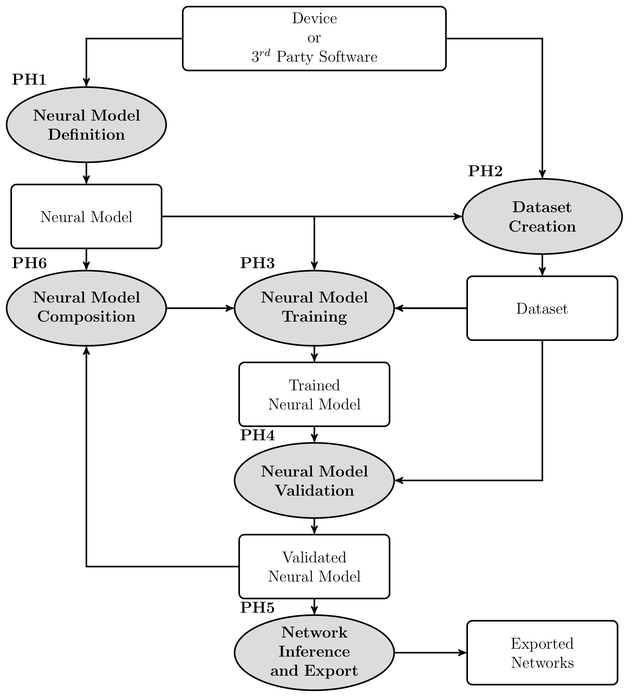

Within the Neu4mes project, the **framework** is the first main outcome: open-source software to design, train, validate, and deploy **model-structured neural networks** (MSNN) for modelling and control of autonomous mechanical systems.

The released implementation is named **nnodely** (*“nn” can be read as “m”, forming Modely*). It is the practical tool that supports the project methodology on real hardware and in the demonstrative case studies (wheel vehicles, quadruped robots, flying drones).

## Purpose

The framework guides development from early experimentation through deployment on embedded platforms. In particular it provides:

- A **library of neural models (NMs)** and **neural controllers (NCs)** for components and complete devices, used as building blocks for full system models
- Tools to investigate different neural modelling and control strategies and to validate **stability and performance** of models and closed-loop systems
- **Export** of trained networks for embedded use (standalone C code, FPGA targets, and interchange via **ONNX** and Functional Mock-up Units **FMU**)
- **Integration** with external tools through APIs

The library is developed as an abstraction layer on top of existing deep-learning backends (such as **Keras3.0** or **PyTorch**), so that the hybrid MSNN approach remains flexible and usable without rebuilding a general-purpose learning stack from scratch.

## Development phases (PH1–PH6)

The **nnodely** development pipeline organises MSNN work in six phases from design to deployment, with iterative composition, retraining, and selective export:

{fig-alt="Overview of the nnodely development pipeline (PH1–PH6)" .framework-diagram}

::: {.framework-phases-table}
| Description | Phase |
|-------------|-------|
| Neural model definition — MSNN structure, inputs/outputs, and high-level specification (Neural Model abstraction) from mechanical principles and domain knowledge | **PH1** |
| Dataset creation — experimental time-series (CSV, DataFrames), splitting, resampling, and automatic temporal windows | **PH2** |
| Neural model training — managed training with custom losses, optimizers, recurrent networks, and closed-loop learning | **PH3** |
| Neural model validation — analysis beyond standard ML metrics (e.g. FVU, AIC, residual and domain-specific checks) | **PH4** |
| Model export — JSON, PyTorch modules, and ONNX for embedded deployment and third-party tools (selective export supported) | **PH5** |
| Model composition — interconnecting modules via connect and closed-loop links; staged training and assembly of complex systems (including controllers) | **PH6** |
:::

## Implementation

A preliminary version of the Neu4mes framework is already available under the name **nnodely**, distributed on [GitHub](https://github.com/tonegas/nnodely) under the **MIT license** (`pip install nnodely`). Tutorials, API reference, and case-study material are published in the [online documentation](https://nnodely.readthedocs.io/en/main/).

During the project, the library is extended with models and controllers from the experimental domains and generalized for reuse by the scientific and industrial community.