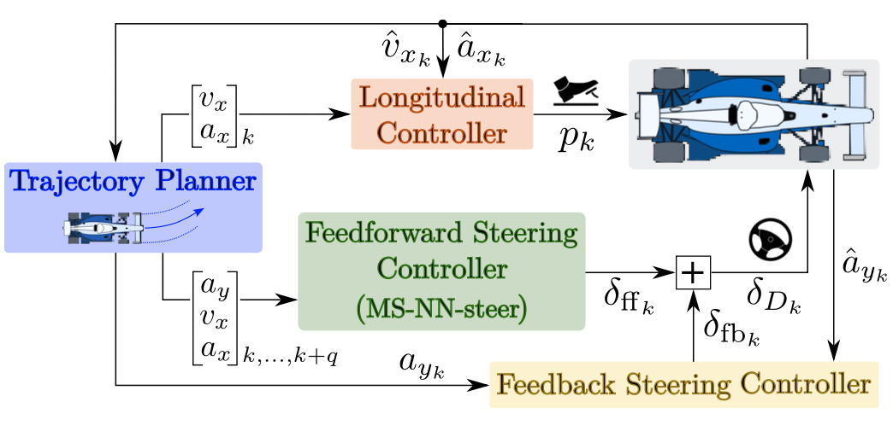
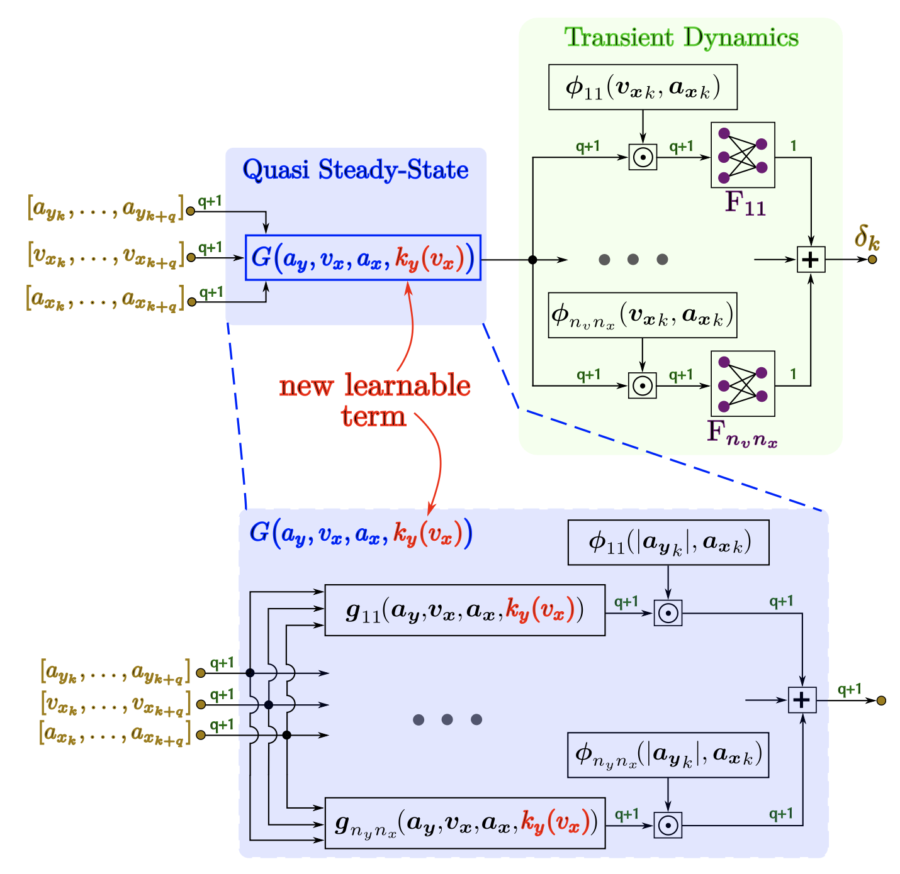

## Abstract

Autonomous vehicle racing has attracted increasing attention in recent years, as a safe and controlled environment to accelerate the development of autonomous driving. This has led to the development of advanced algorithms in vehicle perception, motion planning, and control. Deep learning models, predominantly based on neural networks (NNs), have demonstrated significant potential in modeling the vehicle dynamics and in performing various tasks in autonomous driving. However, their black-box nature is critical in the context of autonomous racing, where safety and robustness demand a thorough understanding of the decision-making algorithms. To address this challenge, this paper proposes **MS-NN-steer**, a new model-structured neural network for vehicle steering control, integrating the prior knowledge of the nonlinear vehicle dynamics into the neural architecture. The proposed controller is validated using real-world data from the Abu Dhabi Autonomous Racing League (A2RL) competition, with full-scale autonomous race cars. In comparison with general-purpose NNs, MS-NN-steer is shown to achieve better accuracy and generalization with small training datasets, while being less sensitive to the weights' initialization. Also, MS-NN-steer outperforms the steering controller used by the A2RL winning team. Our implementation is available open-source in a public repository.

## Video {#video}



## Model-structured neural network for steering dynamics {toc-text="MSNN for steering dynamics"}

**MS-NN-steer** is a feedforward steering controller in the TUM Autonomous Motorsport stack: it maps planned trajectories from a Tube-MPC planner to the steering angle \(\delta_k\) at the current time step. **Inputs** are windows of future planned lateral acceleration \(a_y\), longitudinal acceleration \(a_x\), and speed \(v_x\) (Eq. (1) in the paper). The controller is combined with a feedback steering loop and a longitudinal controller so that \(\delta_k = \delta_{\mathrm{ff},k} + \delta_{\mathrm{fb},k}\).

### Control framework overview (Figure 2)

**Figure 2** shows how **MS-NN-steer** is integrated in the full-scale A2RL control architecture. The **trajectory planner** provides target \(v_x\), \(a_x\), and a horizon of \([a_y, v_x, a_x]_{k,\ldots,k+q}\). The **longitudinal controller** commands the pedal \(p_k\) from \(v_x\) and \(a_x\) targets and measured \(\hat{v}_{x_k}\), \(\hat{a}_{x_k}\). **MS-NN-steer** (feedforward) outputs \(\delta_{\mathrm{ff},k}\) from the planned trajectory; the **feedback steering controller** adds \(\delta_{\mathrm{fb},k}\) from the measured lateral acceleration \(\hat{a}_{y_k}\). The sum \(\delta_{D,k}\) is applied to the race car, closing the loop with onboard estimates.

::: {.paper-network-figures}
{fig-alt="A2RL control stack: trajectory planner, MS-NN-steer feedforward steering, feedback steering, and longitudinal control" width=95%}
:::

### MS-NN-steer architecture (Figure 4)

**Figure 4** details the internal structure of **MS-NN-steer**. The network extends **MS-NN-base** with a learnable understeering term \(k_y(v_x)\) in the quasi steady-state block \(G(a_y, v_x, a_x, k_y(v_x))\), which captures how steering characteristics change at racing speeds. Local neuro-fuzzy models \(g_{il}(\cdot)\) are activated by membership functions \(\phi_{il}(|a_{y_k}|, a_{x_k})\) and blended in \(G(\cdot)\). A **transient dynamics** stage then applies local layers \(F_{jl}\) with \(\phi_{jl}(v_{x_k}, a_{x_k})\) over the input window to output the steering angle \(\delta_k\). The expanded view at the bottom of the figure shows the parallel local models inside \(G(\cdot)\).

::: {.paper-network-figures}
{fig-alt="MS-NN-steer: quasi steady-state block G with ky(vx) and transient dynamics with neuro-fuzzy local models" width=95%}
:::

The MS-NN-steer blocks are implemented with the **nnodely** framework for structured architectures and deployment in the autonomous racing stack.
