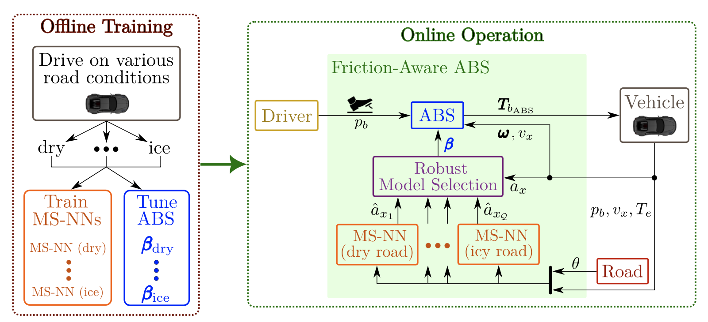
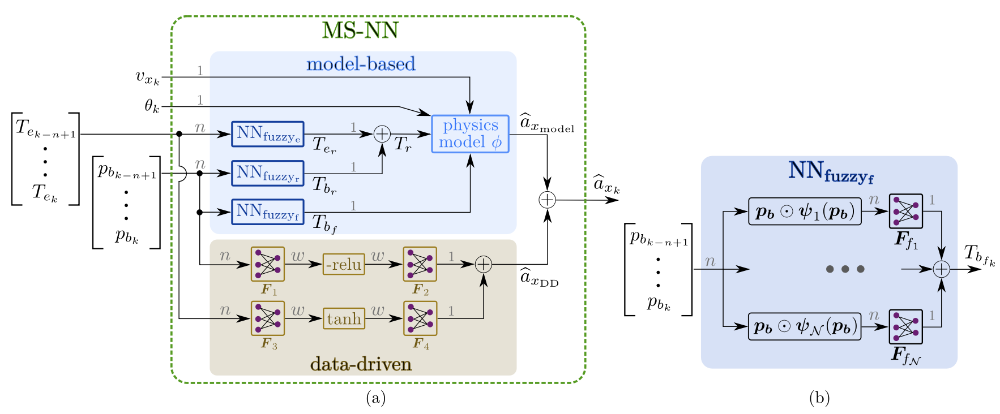

## Abstract

The anti-lock braking system (ABS) is a vital safety feature in modern vehicles, preventing wheel lock during emergency braking. However, the performance of conventional ABS is often limited by the lack of real-time road friction information. This paper introduces a novel road friction-aware ABS, leveraging model-structured neural networks (MSNNs) to learn the vehicle longitudinal dynamics in different road conditions. Our framework uses a robust criterion to dynamically select from a set of pre-trained MSNNs based on the available sensor data, enabling real-time road friction estimation and autonomous adaptation of the ABS parameters. Simulation experiments demonstrate that the proposed MSNN-based ABS significantly improves safety and performance across varying road conditions: the braking distances are reduced by 3.0%–40.4% compared to a conventional ABS, tuned for a specific road condition. Furthermore, the MSNN architecture shows better accuracy, generalization and sample-efficiency compared to other neural networks in the literature, and is suitable for real-time deployment on automotive-grade hardware. Our implementation is open source and available in a public repository.

## Model-structured neural network for road friction-aware ABS {toc-text="MSNN for road friction-aware ABS"}

The friction-aware ABS relies on a **bank of MS-NNs**, each trained offline on a specific road condition (dry, wet, snowy, icy asphalt). Every model predicts the longitudinal acceleration \(\hat{a}_x\) from past measurements of vehicle speed \(v_x\), brake pedal \(p_b\), engine torque \(T_e\), and road slope \(\theta\).

At runtime, a **noise-robust selection criterion** compares the measured acceleration \(a_x\) with the predictions \(\hat{a}_{x,i}\) of all models \(i = 1,\ldots,Q\) and estimates the current friction level. The estimate adapts the ABS parameters \(\beta\) (e.g. slip targets and pressure modulation) without requiring an explicit friction sensor.

### Framework overview (Figure 1)

**Figure 1** summarizes the proposed road friction-aware ABS. On the **left**, the offline phase collects vehicle telemetries from a high-fidelity simulator in different road conditions and trains one MS-NN per friction level. On the **right**, during online operation the driver commands the brake pedal \(p_b\); the adaptive ABS modulates the brake torques \(\mathbf{T}_b^{\mathrm{ABS}}\) at the front and rear wheels using vehicle speed \(v_x\), wheel speeds \(\omega\), and parameters \(\beta\) that are updated from the estimated road condition. Road friction is inferred by comparing the measured longitudinal acceleration \(a_x\) with the predictions \(\hat{a}_{x,i}\) of the MS-NNs and selecting the most consistent model with a noise-robust criterion.

::: {.paper-network-figures}
{fig-alt="Road friction-aware ABS: offline training and online operation with MS-NN bank and selection criterion" width=95%}
:::

### MS-NN architecture (Figure 2)

**Figure 2(a)** shows the internal structure of the MS-NN used to learn longitudinal vehicle dynamics. The network takes windows of engine torque \(T_e\) and brake pedal \(p_b\), the current speed \(v_x\), and road slope \(\theta\), and outputs \(\hat{a}_x\). It combines a **model-based** branch (Newton equation with neuro-fuzzy local models for the front brake torque \(T_{bf}\)) and a **data-driven** branch that captures residual effects; the two contributions are summed as \(\hat{a}_x = \hat{a}_{x_{\mathrm{model}}} + \hat{a}_{x_{\mathrm{DD}}}\). **Figure 2(b)** details the local neuro-fuzzy models that estimate \(T_{bf}\) from \(p_b\) and \(T_e\): membership functions \(\psi_{bi}(p_b)\) and \(\psi_{ej}(T_e)\) activate \(N\) local models whose outputs are blended with coefficients \(F_i\). Gray numbers on the signal arrows indicate tensor sizes in the implementation.

::: {.paper-network-figures}
{fig-alt="MS-NN internal architecture (a) and local neuro-fuzzy models for front brake torque (b)" width=95%}
:::

The MSNN blocks are implemented with the **nnodely** framework for structured architectures and real-time deployment on automotive-grade hardware.
