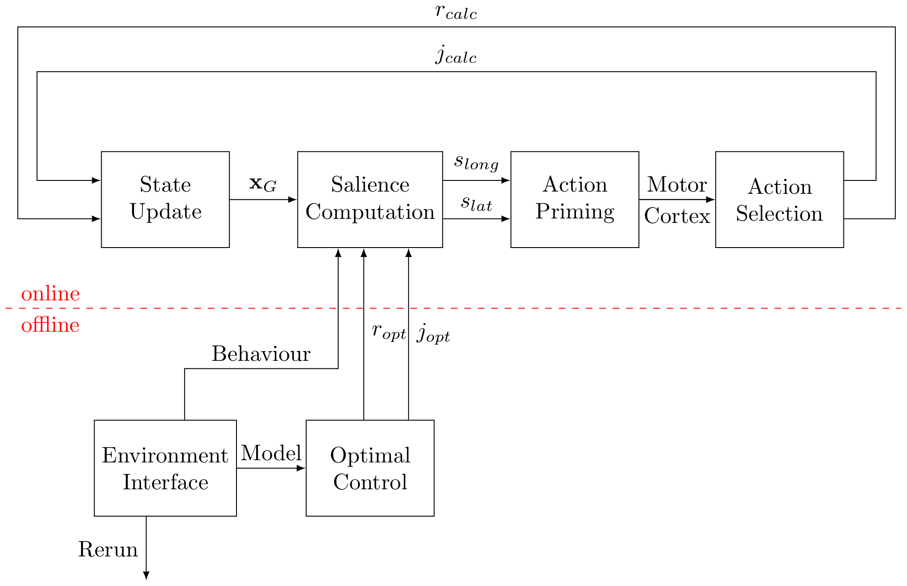
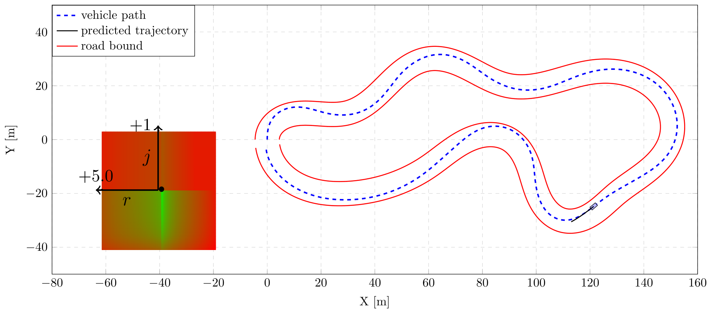
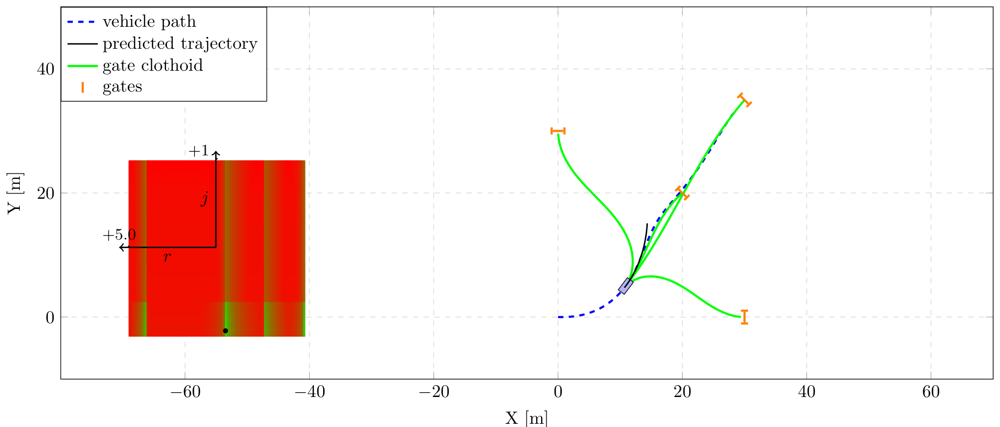
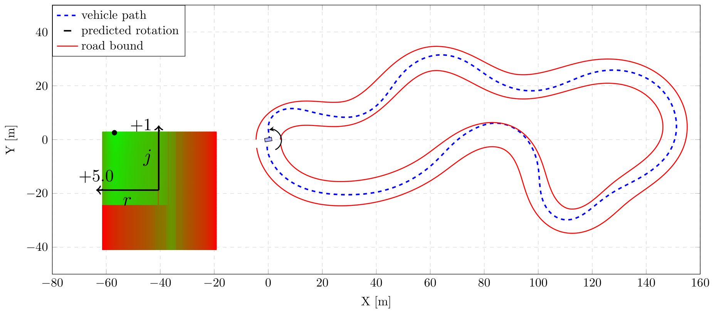
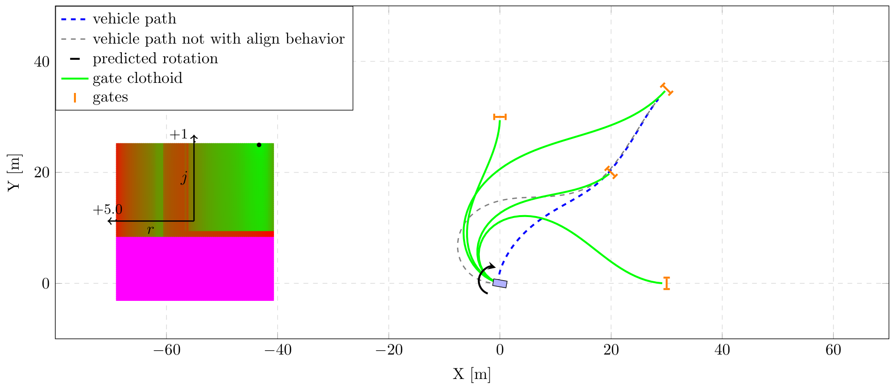
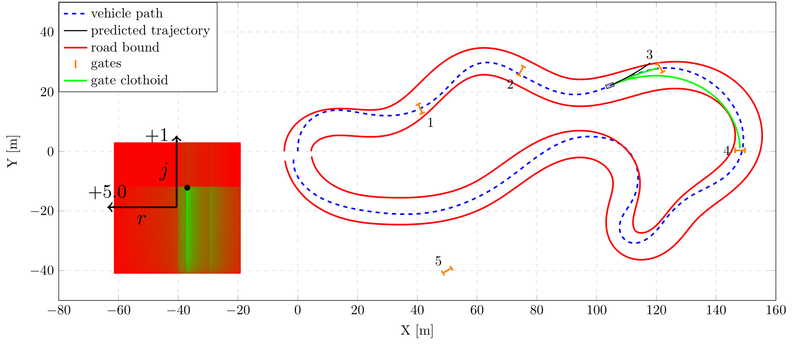

## Abstract

Modern autonomous systems rely on motion planning as a core component for safe and efficient navigation. While physical hardware varies across platforms, the primary challenge is translating high-level goals into smooth, feasible trajectories. In complex, dynamic environments, a planner must also be computationally efficient enough to react to sudden changes. Developing algorithms that maintain these properties across different operating conditions is essential for the reliability of any autonomous agent. This work presents an autonomous vehicle planning framework designed to handle both structured road-following and unstructured scenarios, such as target-gate navigation. Through a modular architecture, the system enables a smooth transition between these environments without requiring discrete shifts in the underlying logic. Furthermore, the framework is extended to support multiple vehicle models, allowing the planner to adjust its kinematic constraints based on the specific maneuver or platform. Experimental results across diverse environments demonstrate that the planner maintains boundary compliance and feasibility for the planned motion, establishing a robust foundation for a unified, multi-model planning architecture.

## Modular salience-based motion planning {toc-text="Modular motion planner"}

The framework extends the affordance-competition architecture of Da Lio et al. to a single planner capable of operating across structured (road-following) and unstructured (gate-based) domains without distinction, while simultaneously embedding multiple vehicle kinematic models — a bicycle model for nominal driving and a unicycle model for low-speed, rotation-heavy alignment maneuvers. Jerk-optimal motion primitives are derived analytically offline via Pontryagin's maximum principle; online, candidate trajectories are evaluated in parallel and reduced to a two-dimensional **salience matrix** (the "motor cortex") over longitudinal and lateral jerk, from which a winner-takes-all action-selection stage picks the lowest-cost, most comfortable maneuver.

### Planning pipeline (Figure 1)

**Figure 1** shows the modular pipeline: an offline stage computes closed-form jerk-optimal motion primitives from the vehicle model, while the online loop updates the state, computes the salience of each candidate action, primes and merges behaviours into a shared motor cortex, and selects the final action. The decoupled structure lets individual blocks — vehicle model, behaviour, or environment interface — be modified independently.

::: {.paper-network-figures}
{fig-alt="Planning pipeline: offline optimal control computes motion primitives; online state update, salience computation, action priming, motor cortex and action selection" width=95%}
:::

### Base scenarios: structured and unstructured navigation (Figure 2)

**Figure 2(a)** shows the structured scenario, where the vehicle path (blue dotted line) remains within the road bounds while a snapshot of the motor cortex highlights the winning, minimum-jerk maneuver. **Figure 2(b)** shows the unstructured scenario, where multiple target gates are evaluated in parallel through their associated clothoid curves, and the motor cortex reveals one salience peak per candidate gate.

::: {.paper-network-figures}
{fig-alt="Structured environment: vehicle path following road bounds with motor cortex snapshot" width=95%}

{fig-alt="Unstructured environment: vehicle navigating multiple gates with associated clothoid trajectories and motor cortex snapshot" width=95%}
:::

### Merged behaviours: alignment and mixed scenarios (Figure 3)

**Figure 3** shows the motor cortex merging multiple behaviours pairwise. In **(a)** and **(b)**, the alignment behaviour is merged with, respectively, the structured and unstructured base scenarios: the vehicle starts with a severe heading error and the unicycle-based alignment maneuver rotates it back onto the road or gate-clothoid direction before nominal bicycle-model tracking resumes; panel (b) also contrasts the aligned trajectory (blue) with a baseline generated under the same initial conditions but without the alignment behaviour (grey). In **(c)**, the structured and unstructured behaviours are merged into a single mixed scenario: the vehicle stays within the road boundaries while passing through the gates that keep it on the road, and correctly bypasses gate 5, which lies outside the road bounds.

::: {.paper-network-figures}
{fig-alt="Alignment behaviour merged with the structured scenario" width=95%}

{fig-alt="Alignment behaviour merged with the unstructured scenario, with a baseline path shown for comparison" width=95%}

{fig-alt="Mixed scenario merging structured and unstructured behaviours, passing through reachable gates and bypassing gate 5" width=95%}
:::

## Video comparisons {#video}

The following recordings, captured in the [Rerun](https://github.com/rerun-io/rerun) visualization environment used for the experiments, complement Figures 2 and 3 by showing the planner's behaviour over time rather than as single snapshots.

### Sharp turn: with vs. without alignment

Side-by-side comparison of the vehicle negotiating a sharp turn with the alignment behaviour enabled and disabled.





### Alignment in the structured (road) scenario



### Alignment in the unstructured (gate) scenario



### Alignment in the mixed scenario



### Mixed scenario: structured + unstructured



The planner is implemented as a lightweight C++ module for real-time execution, with the offline motion primitives and online salience computation kept fully decoupled to ease the integration of additional vehicle models or behaviours.
