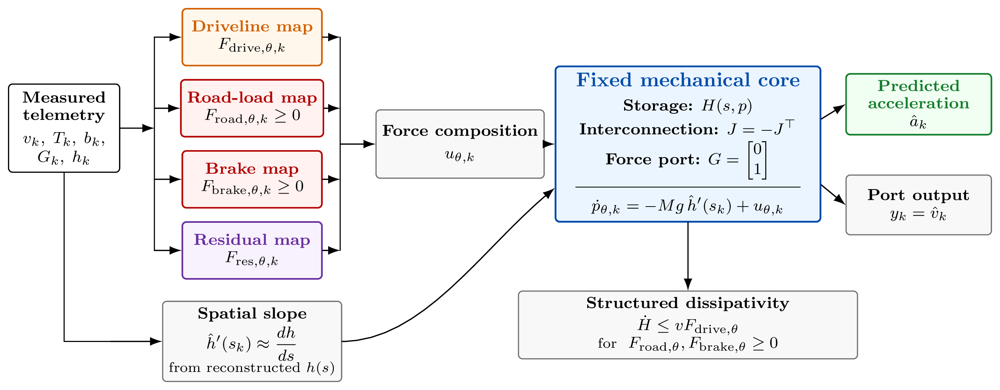
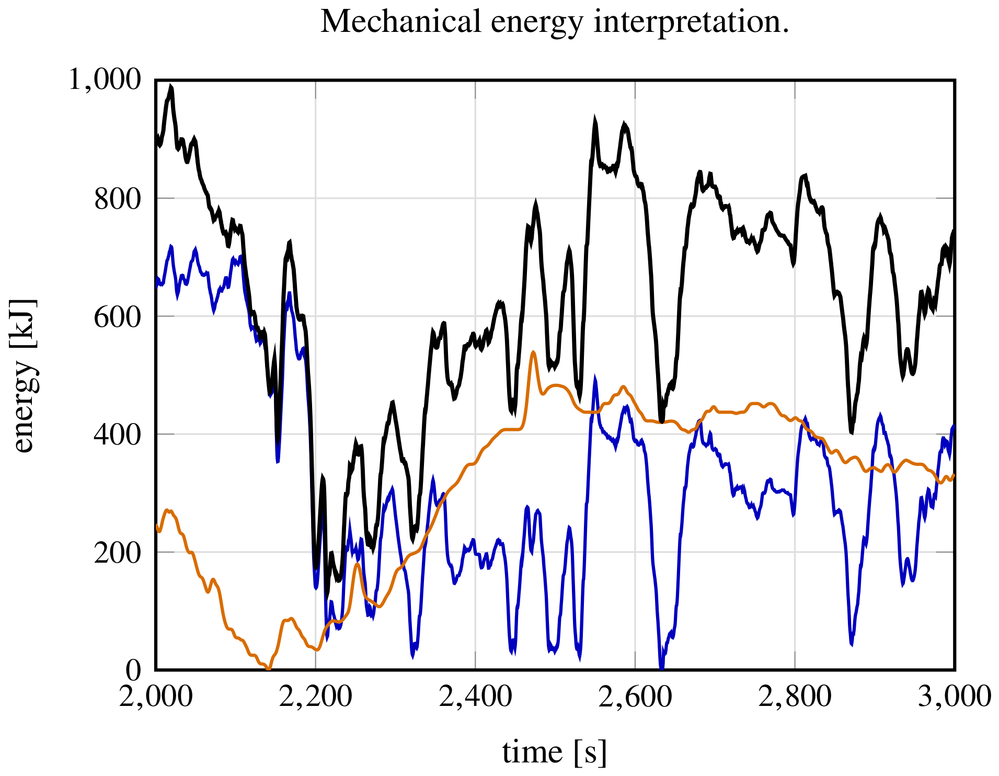
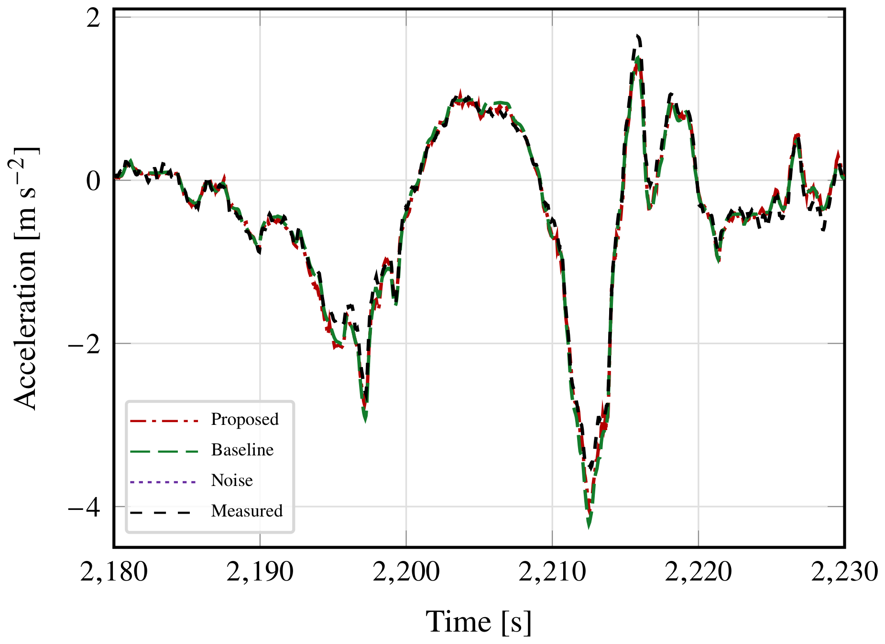
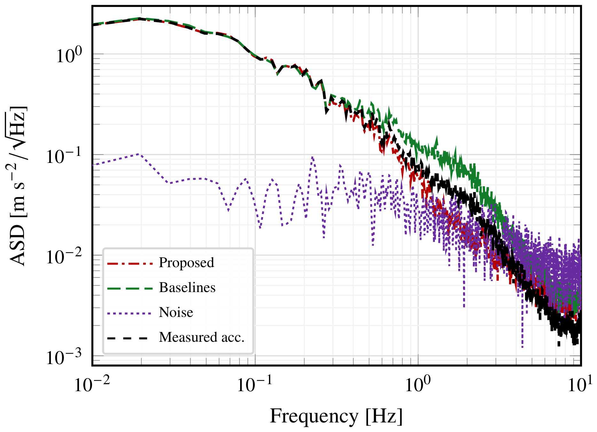

## Abstract

In this note, we develop a port-Hamiltonian-inspired model-structured neural network (MSNN) for longitudinal vehicle-dynamics identification. In the MSNN paradigm, part of the computational graph is fixed from physical principles, while trainable neural modules are assigned only to unknown governing equations. The proposed model follows this principle and extends an existing structured framework for longitudinal vehicle dynamics by imposing an explicit mechanical energy balance and nonnegative dissipative force channels. This work does not propose a fully free port-Hamiltonian neural state-space model. Instead, it embeds the longitudinal acceleration identification problem inside a fixed mechanical storage and momentum-balance structure. This makes the mechanical power balance hold by construction, rather than through an added loss penalty. The model is trained using measured velocity, acceleration, driveline actuation, braking, gear selection, and altitude, without calibrated wheel-force measurements, drivetrain maps, aerodynamic coefficients, rolling-resistance constants, or controlled dynamometer tests. The learned components are therefore interpreted as effective longitudinal force terms consistent with the available telemetry and the imposed port-Hamiltonian structure, while the model identifies the vehicle's longitudinal acceleration from the measured data.

## Port-Hamiltonian-inspired model-structured neural network {toc-text="PH-inspired MSNN"}

The model formulates longitudinal identification from an energy and port-based viewpoint: the vehicle is described through a fixed mechanical storage $H(s,p)$, whose rate of change is governed by power exchanged through longitudinal force ports. Fixing the Hamiltonian, the skew-symmetric interconnection $J=-J^\top$, and the force port $G$ separates conservative storage effects from externally supplied and dissipated power, so the predicted acceleration $\hat a_k$ is not produced by an unconstrained input–output map, but by a learned force balance embedded in a prescribed mechanical energy structure. Neural learning is restricted to the non-conservative force laws (driveline, road-load, braking, and a bounded residual), while road-load and braking are constrained to be nonnegative, guaranteeing that $\dot H \le vF_{\mathrm{drive},\theta}$ by construction rather than through an added loss penalty.

### Structured port-Hamiltonian architecture (Figure 1)

**Figure 1** shows the resulting grey-box architecture. Measured telemetry ($v_k$, $T_k$, $b_k$, $G_k$, $h_k$) feeds four learned force channels — a gear-dependent driveline map $F_{\mathrm{drive},\theta,k}$, a nonnegative road-load map $F_{\mathrm{road},\theta,k}$, a nonnegative brake map $F_{\mathrm{brake},\theta,k}$, and a bounded residual map $F_{\mathrm{res},\theta,k}$ — together with a spatial-slope branch that reconstructs the road grade $\hat h'(s_k)$ from the altitude signal. These contributions are summed into the force $u_{\theta,k}$ and injected into the fixed mechanical core, where the momentum balance $\dot p_{\theta,k} = -Mg\,\hat h'(s_k) + u_{\theta,k}$ yields the predicted acceleration $\hat a_k$ and the collocated port output $y_k=\hat v_k$, subject to the structured dissipativity certificate $\dot H \le vF_{\mathrm{drive},\theta}$.

::: {.paper-network-figures}
{fig-alt="Port-Hamiltonian-inspired architecture: driveline, road-load, brake and residual force maps feeding a fixed mechanical core that outputs predicted acceleration and port velocity" width=95%}
:::

### Mechanical energy balance (Figure 2)

**Figure 2** decomposes the mechanical storage $H=K+U$ over the validation interval of the Lancia Delta on-road benchmark of Da Lio et al.: the kinetic energy $K$ (blue), the gravitational potential energy $U$ (orange), and their sum, the total mechanical storage $H$ (black). Because the port-Hamiltonian structure is fixed rather than learned, this decomposition follows directly from the measured velocity and the reconstructed road-altitude profile, and it is used as a diagnostic to check that the learned force channels remain consistent with the imposed energy-rate identity.

::: {.paper-network-figures}
{fig-alt="Mechanical storage decomposition over the validation interval: kinetic energy, gravitational potential energy, and total mechanical storage" width=95%}
:::

### Acceleration tracking (Figure 3)

**Figure 3** compares the measured, proposed, and baseline (structured FIR) acceleration predictions over a representative transient interval spanning both traction and braking phases. The proposed model, which adds a bounded residual correction on top of the structured FIR backbone, closely tracks the measured acceleration, including the sharp braking transient around $t\approx2213\,\mathrm{s}$, while remaining within the estimated acceleration-noise level used as a reference in the residual analysis.

::: {.paper-network-figures}
{fig-alt="Comparison of measured, proposed, and baseline acceleration over a representative transient interval" width=95%}
:::

### Spectral consistency (Figure 4)

**Figure 4** reports the amplitude spectral density (ASD) of the corrected validation acceleration, the proposed prediction, the structured baseline, and the estimated noise floor. The proposed model tracks the measured acceleration spectrum more closely than the baseline across most of the frequency range, approaching the noise floor at high frequencies, which indicates that the residual correction removes structured baseline error without simply fitting noise.

::: {.paper-network-figures}
{fig-alt="Amplitude spectral density of the corrected validation acceleration, proposed prediction, established baseline, and estimated noise" width=95%}
:::

The proposed model achieves a validation acceleration RMSE of $0.1029\,\mathrm{m/s^2}$, improving over the structured FIR baseline ($0.1087\,\mathrm{m/s^2}$) and over the convolutive/recurrent baselines of Da Lio et al. ($0.105$–$0.158\,\mathrm{m/s^2}$), while the measured mechanical energy variation closely matches the model-implied power balance (power-identity RMS error of $4.89\times10^{-4}\,\mathrm{W}$). The model is implemented with the **nnodely** framework for structured architectures and physically constrained neural modules.
