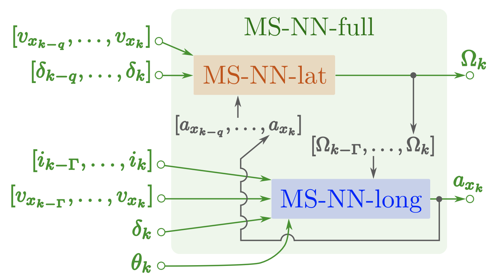
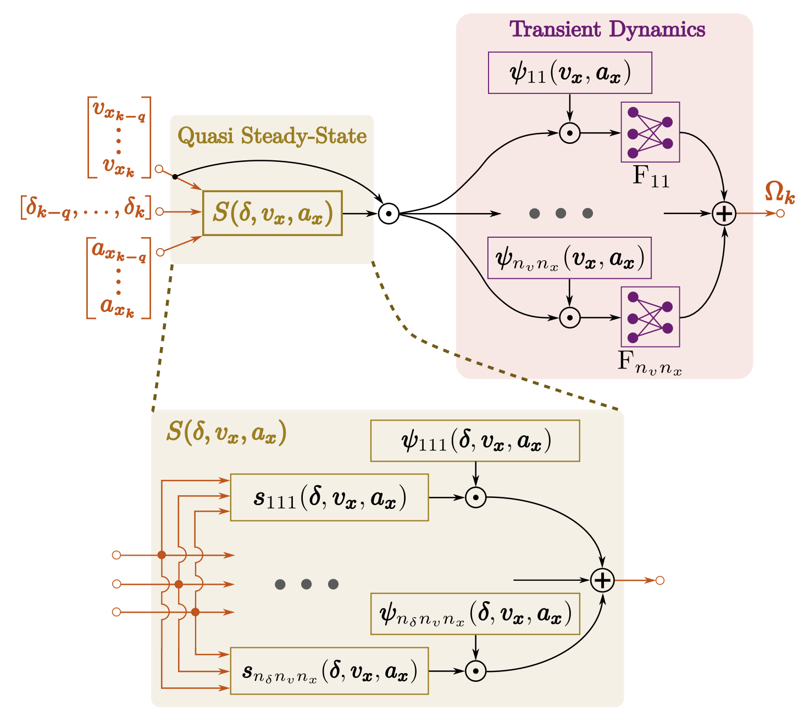
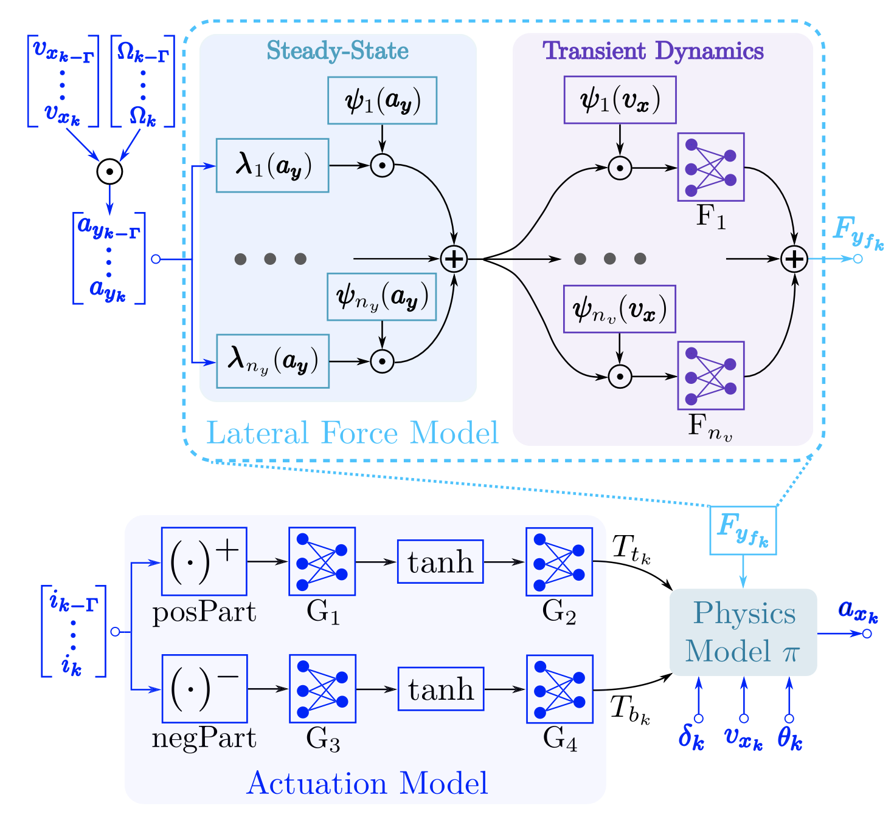

## Abstract

Modeling the vehicle dynamics near the handling limits is crucial for autonomous driving and racing. However, building accurate models remains challenging due to strong nonlinearities, limited data availability, and changing environmental conditions. Physics-based models offer interpretability but require costly parameter identification, while general-purpose neural networks typically need large datasets to generalize. This paper introduces a new model-structured neural network (**MS-NN-full**) that learns the coupled lateral–longitudinal vehicle dynamics by embedding physical knowledge into its internal architecture. MS-NN-full combines physics-inspired neuro-fuzzy models with data-driven components to capture the quasi-steady-state and transient behavior, as well as the mutual coupling between the lateral and longitudinal dynamics. Experimental results on a 1:10-scale autonomous vehicle show that MS-NN-full outperforms existing MSNN baselines and general-purpose neural networks in accuracy and generalization, using less than two minutes of training data. The model also demonstrates rapid adaptation to new tire configurations and increased vehicle mass with minimal fine-tuning. We release our implementation and datasets to support further research in physics-guided learning for autonomous systems.

## Model-structured neural network for vehicle dynamics {toc-text="MSNN for vehicle dynamics"}

**MS-NN-full** learns coupled lateral–longitudinal dynamics on a RoboRacer platform. It takes windows of longitudinal speed \(v_x\), steering angle \(\delta\), motor current \(i\), and road slope \(\theta\), and predicts yaw rate \(\Omega\) and longitudinal acceleration \(a_x\). The architecture comprises two interconnected sub-networks—**MS-NN-lat** and **MS-NN-long**—trained in two stages: independent fitting of each sub-network, then fine-tuning of the closed-loop **MS-NN-full**. Gray signals in the full model close the loop: \(a_x\) from MS-NN-long feeds MS-NN-lat, and \(\Omega\) from MS-NN-lat feeds MS-NN-long.

### MS-NN-full architecture (Figure 1)

**Figure 1(a)** shows the overall **MS-NN-full** architecture. Green arrows denote inputs (past windows of \(v_x\), \(\delta\), \(i\), and \(\theta\)) and outputs (\(\hat{\Omega}\), \(\hat{a}_x\)). Gray signals are internal variables linking **MS-NN-lat** (lateral) and **MS-NN-long** (longitudinal), capturing their mutual influence near the handling limits.

::: {.paper-network-figures}
{fig-alt="MS-NN-full: coupled lateral MS-NN-lat and longitudinal MS-NN-long with closed-loop gray signals" width=95%}
:::

### MS-NN-lat architecture (Figure 1b)

**Figure 1(b)** details **MS-NN-lat**, which learns the combined lateral vehicle dynamics. The network combines a **quasi steady-state** block \(S(\delta, v_x, a_x)\)—built from local neuro-fuzzy models on the handling diagram—with a **transient dynamics** stage. Local fully connected layers \(F_{lp}\) (purple blocks) are activated by membership functions \(\psi_{lp}(v_x, a_x)\); their outputs are blended over the input window and multiplied by \(v_{x_k}\) to obtain \(\hat{\Omega}_k\), following Eq. (5) in the paper.

::: {.paper-network-figures}
{fig-alt="MS-NN-lat: quasi steady-state and transient lateral dynamics with neuro-fuzzy local models" width=95%}
:::

### MS-NN-long architecture (Figure 3)

**Figure 3** shows **MS-NN-long**, which predicts longitudinal acceleration \(\hat{a}_{x_k}\) from windows of motor current \(i\), speed \(v_x\), steering \(\delta_k\), road slope \(\theta_k\), and yaw rate \(\Omega\) (from MS-NN-lat). The architecture includes a **lateral force model** (steady-state and transient blocks estimating front lateral force \(F_{y_{f_k}}\)), an **actuation model** (neural networks \(G_1\)–\(G_4\) learning motor torque \(T_{t_k}\) and brake torque \(T_{b_k}\) from \(i_k\)), and a **physics model** \(\pi\) that integrates these contributions with \(\delta_k\), \(v_{x_k}\), and \(\theta_k\) to output \(\hat{a}_{x_k}\). The symbol \(\odot\) denotes the Hadamard (element-wise) product.

::: {.paper-network-figures}
{fig-alt="MS-NN-long: lateral force model, actuation model, and physics model for longitudinal acceleration" width=95%}
:::

The MS-NN blocks are implemented with the **nnodely** framework for structured architectures and deployment on embedded platforms.
