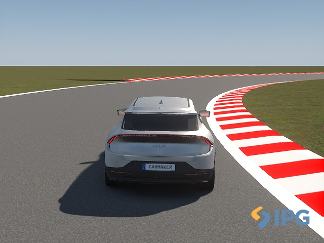
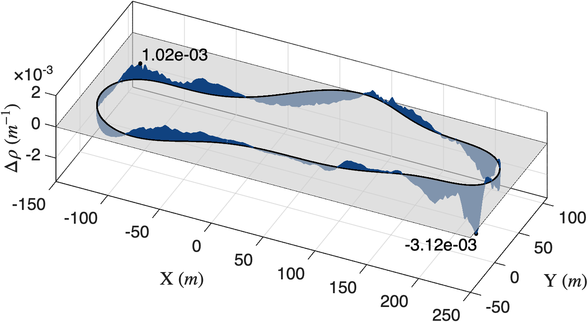

## Abstract

Vehicle dynamics modeling and control are challenging due to nonlinearities, uncertainty, and the trade-off between accuracy, interpretability, and computational cost. This work presents a unified framework for vehicle identification and lateral control based on Model-Structured Neural Networks (MS-NNs), which embed physical knowledge directly into the neural architecture. A structured lateral dynamics model is derived from vehicle handling analysis and trained on high-fidelity CarMaker telemetry to predict vehicle curvature. The identified model is then used as a differentiable plant to train a neural steering controller through recurrent optimization. The approach reduces complexity while maintaining interpretability and generalization. The model achieves a curvature prediction error of about $5\times10^{-3}\,\mathrm{m^{-1}}$, and the controller reaches a tracking error of $1.34\times10^{-3}\,\mathrm{m^{-1}}$. Exported to ONNX and validated in closed loop within CarMaker, the controller demonstrates improved curvature tracking compared with the reference controller under the considered case-study assumptions. These results suggest that MS-NNs provide an effective framework for vehicle identification and control with limited prior knowledge and a reduced number of trainable parameters.

## Model-structured neural network for lateral identification and control {toc-text="MSNN for lateral control"}

The proposed framework follows a two-step approach: first, an MS-NN forward model is identified from CarMaker telemetry to predict the vehicle's steady-state curvature; then, a neural steering controller is connected to the (frozen) forward model and trained recurrently through episodic simulation, so that the controller-plant loop approaches a unitary transfer. The forward model is inspired by the vehicle handling diagram (HD), $\delta-\rho L$, and predicts the curvature $\rho_{k+1}$ from a window of past steering values $\boldsymbol\delta_k$, the current speed $v_k$, and lateral acceleration $a_k$, using a speed-dependent FIR filter combined with a parametric understeering function activated by triangular fuzzy membership functions — a total of 72 trainable parameters. The steering controller, with 39 trainable parameters, receives future windows of target velocity $\mathbf{v}_{t,k}$ and curvature $\boldsymbol{\rho}_{t,k}$ together with a past window of realized steering angles, and is trained by minimizing the error on the *predicted curvature* rather than directly on the steering angle, which avoids the ill-conditioning that arises near front-axle saturation.

### CarMaker simulation environment (Figure 1)

**Figure 1** shows the CarMaker simulation environment used to generate the training and validation datasets: a high-fidelity 14-DoF electric vehicle model driven over synthetic tracks and real racing circuits such as Hockenheim, covering a wide range of curvature profiles and operating conditions up to the saturation of the front axle.

::: {.paper-network-figures}
{fig-alt="CarMaker simulation environment showing the electric vehicle model on a test track" width=95%}
:::

### Curvature tracking error along the test track (Figure 6)

The trained controller was exported to ONNX and evaluated in closed loop within CarMaker on a dedicated test circuit, with the driver's corner-cutting coefficient set to zero so the vehicle follows the road centerline. **Figure 6** reports the resulting curvature tracking error $\Delta\rho$ along the entire test track: the proposed neural controller achieves a curvature RMSE of $3.4\times10^{-3}\,\mathrm{m^{-1}}$, compared with $6.8\times10^{-3}\,\mathrm{m^{-1}}$ for the reference CarMaker controller, while requiring a more moderate steering demand.

::: {.paper-network-figures}
{fig-alt="Curvature tracking error along the test track, comparing the neural controller with the CarMaker reference controller" width=95%}
:::

Both the forward model and the controller are implemented and trained with the **nnodely** framework, which provides a modular, domain-oriented interface for designing, training, validating, and deploying model-structured neural networks.
