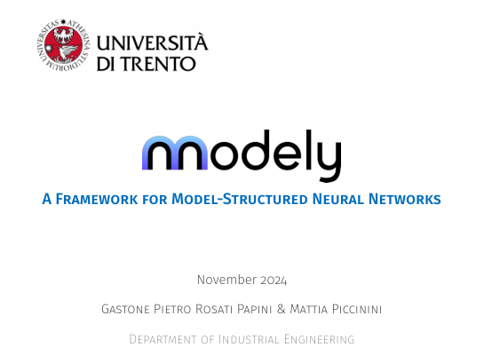

## Summary

Presentation by **Gastone Pietro Rosati Papini** and **Mattia Piccinini** at the **Department of Industrial Engineering, University of Trento** (2024). The seminar *A Framework for Model-Structured Neural Networks* motivates MSNNs versus generic MLPs, reviews related approaches, presents the **nnodely** workflow, and outlines use cases for modeling and control of physical systems.

::: {.presentation-preview}
{fig-alt="First slide: A Framework for Model-Structured Neural Networks" width=95%}
:::
