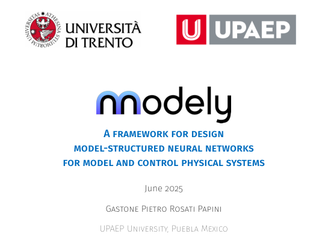

## Summary

Presentation by **Gastone Pietro Rosati Papini** at **UPAEP University, Puebla, Mexico** (2025) on a **framework for designing model-structured neural networks for modeling and control of physical systems**. The talk covers the **Neu4mes** project, motivation for MSNNs versus black-box networks, the **nnodely** workflow, and demonstrative use cases on drones, quadrupeds, and vehicles.

::: {.presentation-preview}
{fig-alt="First slide: framework for MSNN design at UPAEP" width=95%}
:::
