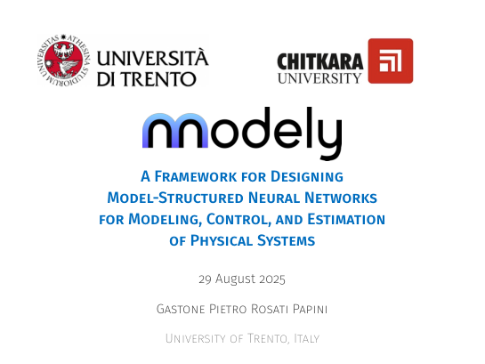

## Summary

Presentation by **Gastone Pietro Rosati Papini** at **Chitkara University, India** (2025), for the **2nd International Conference on Machine Learning Algorithms (ICML-ALGO)**. The talk *A Framework for Designing Model-Structured Neural Networks for Modeling, Control, and Estimation of Physical Systems* introduces MSNNs for modeling, control, and estimation, the **Neu4mes** program, the **nnodely** framework, and application examples on autonomous platforms.

::: {.presentation-preview}
{fig-alt="First slide: Framework for designing MSNNs, ICML-ALGO 2025" width=95%}
:::
