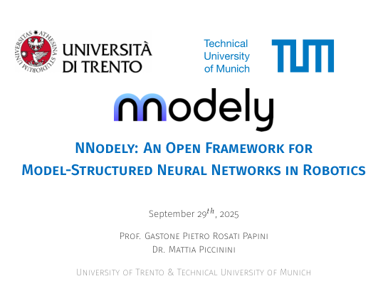

## Summary

Presentation by **Gastone Pietro Rosati Papini** and **Mattia Piccinini** **University of Trento & Technical University of Munich** at **Ekumen Robotics Software Company, Germany** (2025). The talk *NNodely: An Open Framework for Model-Structured Neural Networks in Robotics* presents the open **nnodely** framework, contrasts black-box deep learning with physics-guided MSNNs, and discusses robotic use cases and deployment.

## Video {#video}



::: {.presentation-preview}
{fig-alt="First slide: NNodely open framework for MSNNs in robotics" width=95%}
:::
