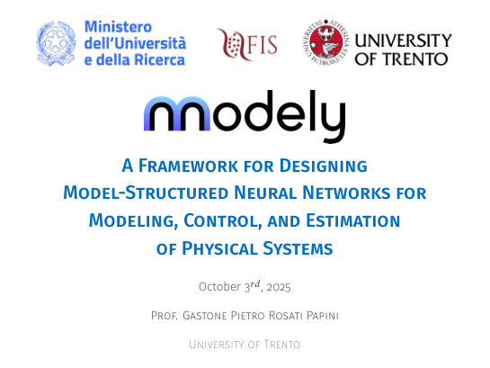

## Summary

Presentation by **Gastone Pietro Rosati Papini** at the **Workshop-COSENO, University of Trento, Italy** (2025). The talk *A Framework for Designing Model-Structured Neural Networks for Modeling, Control, and Estimation of Physical Systems* reviews limitations of standard MLPs, introduces model-structured learning, describes the **nnodely** tool chain, and presents use cases on autonomous mechanical and mechatronic systems.

::: {.presentation-preview}
{fig-alt="First slide: Framework for MSNN modeling, control and estimation" width=95%}
:::
