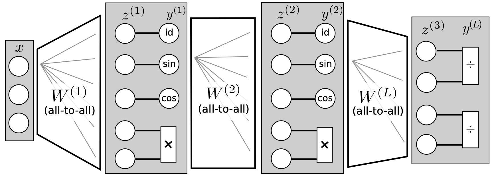

## Abstract

We present an approach to identify concise equations from data using a shallow neural network approach. In contrast to ordinary black-box regression, this approach allows understanding functional relations and generalizing them from observed data to unseen parts of the parameter space. We show how to extend the class of learnable equations for a recently proposed equation learning network to include divisions, and we improve the learning and model selection strategy to be useful for challenging real-world data. For systems governed by analytical expressions, our method can in many cases identify the true underlying equation and extrapolate to unseen domains. We demonstrate its effectiveness by experiments on a cart-pendulum system, where only 2 random rollouts are required to learn the forward dynamics and successfully achieve the swing-up task.

## Equation-learning neural network (EQL) {toc-text="EQL network"}

The paper extends the **Equation Learner (EQL)** of Martius and Lampert with **division units**, yielding **EQL**: a shallow, structured network whose hidden units are algebraic building blocks rather than homogeneous nonlinearities. The goal is to recover concise symbolic dynamics that **extrapolate** outside the training region—relevant for control and for the later **model-structured** line of work in Neu4mes.

### Architecture (Figure 1)

**Figure 1** shows EQL with $L = 3$ layers and one neuron per function type ($u = 3$ unary, $v = 1$ binary unit per layer). Each layer $l = 1,\ldots,L$ is built as follows:

1. **Linear mixing** of the previous layer output: $\mathbf{z}^{(l)} = W^{(l)} \mathbf{y}^{(l-1)} + \mathbf{w}_o^{(l)}$.
2. **Unary units** on the first $u$ components of $\mathbf{z}^{(l)}$, with fixed elementary functions $f_i \in \{\mathrm{id}, \sin, \cos\}$, so each channel applies one interpretable nonlinearity to a scalar input.
3. **Binary units** on the remaining $2v$ components, taken in pairs; in the hidden layers these are **multiplication** gates $g_j(a,b) = a \cdot b$, which compose products of sub-expressions.
4. **Concatenation** of all unary and binary outputs into $\mathbf{y}^{(l)}$, which feeds the next layer.

In the original EQL, the last layer is a linear read-out $\mathbf{y}^{(L)} = W^{(L)} \mathbf{y}^{(L-1)} + \mathbf{w}_o^{(L)}$. In **EQL÷**, the output layer replaces this with **regularized division units** $h_\theta(a,b)$ that return $a/b$ when $b > \theta$ and $0$ otherwise, so rational terms can appear in the learned equation while avoiding poles during training. Divisions are confined to the **final layer**; hidden layers keep products and trigonometric/id blocks only. Together, the stack implements a sparse symbolic expression (sums of products, sines, cosines, and ratios) whose structure is fixed but whose connectivity and linear weights are learned from data.

::: {.paper-network-figures}
{fig-alt="EQL÷ network architecture with three layers: unary id, sin, cos units, multiplication units, and division in the output layer" width=95%}
:::
