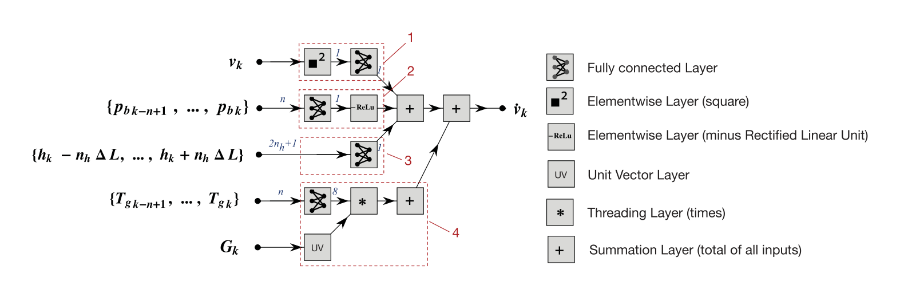

## Abstract

This paper studies neural network models of vehicle dynamics. We consider both models with a generic layer architecture and models with specialised topologies that hard-wire physics principles. Network pre-wiring is limited to universal laws; hence it does not limit the network modelling abilities on one side but allows more robust and interpretable models on the other side. Four different network types (with and without pre-wired structure, recursive and non-recursive) are compared for the longitudinal dynamics of a car with gears and two controls (brake and engine). Results show that pre-wiring effectively improves the performance. Non-recursive networks also look to be preferable for several reasons.

## Physics-pre-wired longitudinal dynamics {toc-text="Structured NN"}

The study compares four convolutional and recurrent architectures for predicting **longitudinal acceleration** from brake pressure, engine torque, road grade, gear, and speed, using real data from a passenger car. The central idea is to implement the generic input–output map as a **sum of physically meaningful contributions** rather than as a single black-box MLP. The **structured convolutional network (ii)** in Figure 2 is the most relevant design for later **model-structured** thinking in Neu4mes.

### Structured convolutional network (Figure 2)

**Figure 2** shows network **(ii)**: a shallow, **physics-pre-wired** architecture with only **248** learnable parameters (versus **821** for the unstructured network (i) in Figure 1 of the paper). Inputs are processed on **four parallel branches** that model distinct terms in the longitudinal force balance; their outputs are summed to predict acceleration $\hat{a}_x$. The dotted boxes in the figure correspond to:

1. **Air drag and rolling resistance (top)** — instantaneous speed $v_x$ is squared and passed through a single neuron that learns drag coefficient and rolling-resistance offset (gain and bias). Only current speed is used here, so drag is modelled without differentiating velocity.
2. **Braking (second row)** — a history of $n=25$ past brake pressures (1.25 s at 20 Hz) feeds a small layer that learns brake-induced acceleration, assumed linear in pressure. A **ReLU** enforces that braking can only produce deceleration, which stabilises training.
3. **Road slope (third row)** — estimates the acceleration component due to grade from height/slope-related inputs along the same convolutional logic as the other branches.
4. **Engine torque and driveline (bottom)** — $n=25$ past engine-torque samples enter a layer with **eight outputs**, one per gear (including neutral encoded as a one-hot vector elsewhere in the network). Only the output neuron for the **active gear** is passed downstream, so each gear learns its own propulsive acceleration characteristic while sharing the same torque history window.

Each branch realises one term $f_i(\cdot)$ in the paper’s structured decomposition (Equation (3)): a learned nonlinear function of the relevant input history, combined by summation at the output. Because connectivity mirrors universal longitudinal physics (drag $\propto v^2$, brake force, slope, traction per gear), the model stays interpretable and needs fewer parameters, yet matches measured acceleration more closely than the unstructured baseline—including driveline oscillations after gear shifts.

::: {.paper-network-figures}
{fig-alt="Structured convolutional network for longitudinal vehicle dynamics: air drag, braking, slope, and engine branches" width=95%}
:::

This pre-wired longitudinal model is an early precursor of **model-structured neural networks (MSNN)** and of the structured modelling philosophy pursued in the Neu4mes project with the **nnodely** framework.
