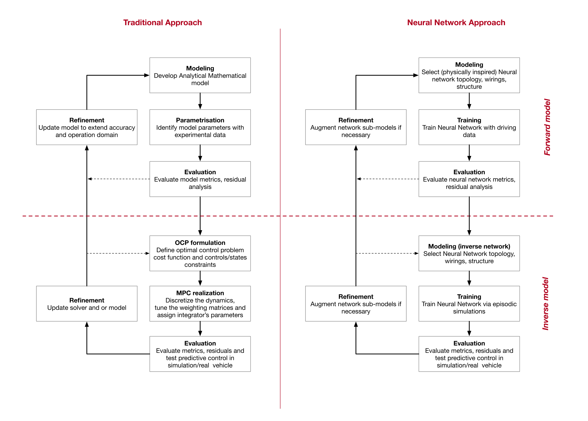
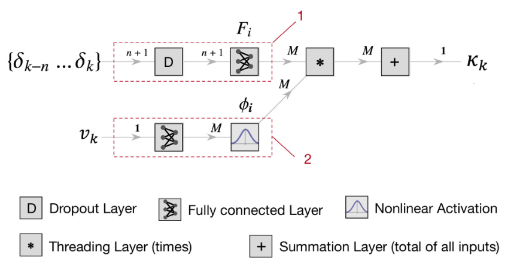
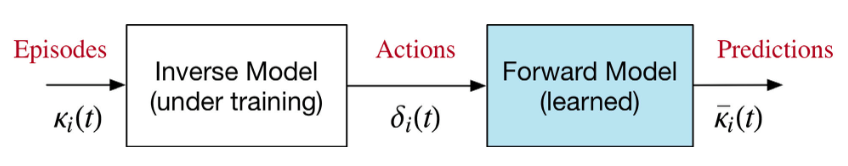
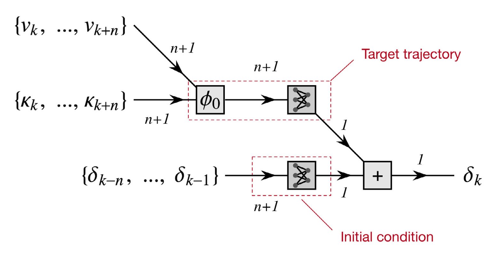

## Abstract

This paper presents a novel approach to learning predictive motor control via mental simulations. The method, inspired by learning through mental imagery in natural cognition, develops in two phases: first, learning predictive (forward) models from data recorded during interaction with the environment; then, at a deferred time, synthesising inverse (control) models via offline episodic simulations. Compared with the classical human-engineered workflow—mathematical modelling of direct dynamics followed by optimal-control inversion—the mental-simulation pipeline gives the agent more autonomy while humans still provide efficient templates for the forward and inverse networks. The networks are built from interpretable local models, in line with cerebellar organisation. The work is demonstrated on lateral vehicle dynamics for a production car (Dreams4Cars), including a first-round forward/inverse pair contrasted with model predictive control, and a second iteration that refines the networks.

## Mental simulation for predictive control {toc-text="Mental simulation"}

The paper reframes autonomous driving control learning as a **two-stage cognitive workflow** rather than a single monolithic optimisation. Stage A learns how the vehicle responds (forward dynamics); Stage B learns how to steer that response (inverse control) by imagining episodes on the already trained forward model—without collecting new on-road data for the inverse map.

### Traditional vs cognitive workflow (Figure 1)

**Figure 1** contrasts the **traditional** pipeline (human derives equations, then MPC or similar inverts them online) with the **cognitive** pipeline proposed here. In the cognitive path, a forward neural model is trained from vehicle logs (stage A, blue block). If needed, the forward model is refined (dashed feedback). Stage B (green) then trains an inverse model **offline** using mental simulations on the forward model, instead of hand-derived differential equations. This separation mirrors control engineering (model, then controller) but replaces explicit maths with structured neural templates at both steps.

::: {.paper-network-figures}
{fig-alt="Traditional control workflow versus cognitive mental-simulation workflow with forward and inverse learning stages" width=95%}
:::

### Forward model: LTV lateral dynamics (Figure 3)

**Figure 3** shows the **forward** network for lateral dynamics, posed as a linear time-varying (LTV) map from steering $\delta$ and speed $v$ to normalised lateral acceleration $\kappa = \ddot{y}/v^2$. The architecture uses **$M$ local FIR models** (here $M=3$), each active in a velocity band centred at $v_i$. Past steering samples $\delta_{t-n},\ldots,\delta_t$ feed parallel branches; a velocity-dependent layer implements the under-steer gradient via $(1 + A v^2)\kappa$, and the branches are blended so the network interpolates between impulse responses learned at the receptive-field centres. Training uses supervised pairs $\{\delta, v\} \rightarrow \kappa$ from a Jeep Renegade on a test track (lane-keeping and manoeuvres). The design encodes interpretable local dynamics—similar in spirit to cerebellar basis functions and to later **model-structured** networks in Neu4mes.

::: {.paper-network-figures}
{fig-alt="Neural network connectivity for LTV lateral vehicle dynamics with M local models and velocity blending" width=95%}
:::

### Learning the inverse via mental simulations (Figure 5)

**Figure 5** explains **stage B**. The inverse model (white block) is still unknown; the forward model (cyan) is fixed after stage A. The agent proposes desired lateral-acceleration episodes $\kappa_i(t)$ and trains the inverse network so that its steering output $\delta_i(t)$, when passed through the forward model, reproduces $\bar{\kappa}_i(t) \approx \kappa_i(t)$. This is an **embodied mental simulation**: control is tested on the learned plant in imagination, and weights are updated from the prediction error—no new physical rollouts for the inverse map. Episodes are built from short random segments of the training log combined with crossover, yielding thousands of imaginary trajectories.

::: {.paper-network-figures}
{fig-alt="Principle of learning inverse control by coupling trainable inverse model to fixed forward model" width=95%}
:::

### Inverse model architecture (Figure 6)

**Figure 6** details the **inverse** network that realises the mental-simulation loop. A target $\kappa$ trajectory enters a single FIR branch (simpler than the forward net: one local model suffices in round 1). Past $\kappa$ values and speed thread through layers that reproduce the under-steer structure, including $(1 + A v^2)\kappa$ with coefficient $A$ reused from the forward model. The output is steering $\delta$. Because neither network is recurrent, FIFO buffers supply the delayed input vectors; the inverse output buffer feeds the forward network input during training. Round 2 in the paper extends the forward model (e.g. more local branches and nonlinear corrections); the same mental-simulation principle applies.

::: {.paper-network-figures}
{fig-alt="Neural network architecture for the inverse lateral-dynamics model with target trajectory and velocity path" width=95%}
:::

Together, the forward structure (Figure 3), the simulation-based training principle (Figure 5), and the inverse architecture (Figure 6) form an early structured-learning pipeline that foreshadows **MSNN** design and the **nnodely** framework in the Neu4mes project.
