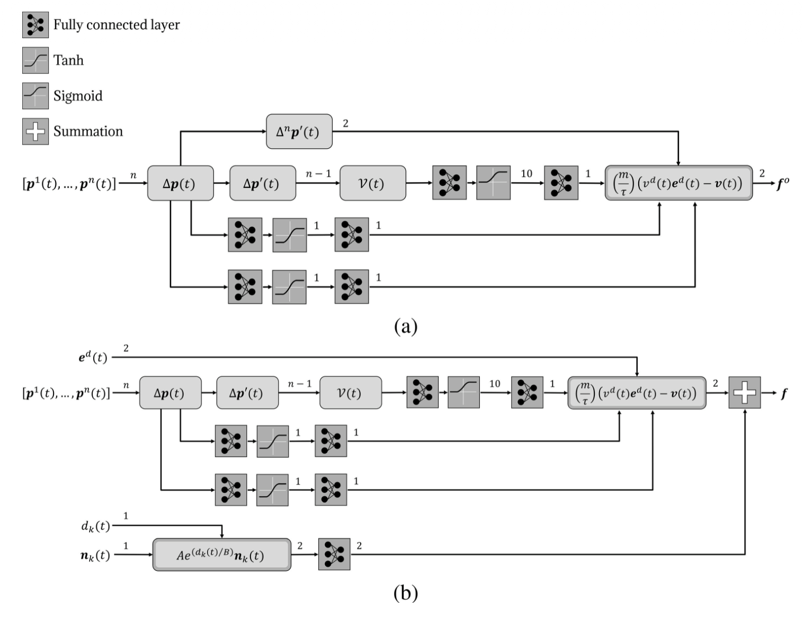

## Abstract

Generating accurate and efficient predictions for the motion of humans in the scene is key to effective motion planning for robots in crowded spaces, where poor forecasts can create safety hazards or socially unacceptable behaviour. The approach uses a **physics-inspired neural network**: unlike a conventional deep MLP, the architecture embeds the **Social Force Model (SFM)** so that neurons implement the known force balance while learning only the uncertain parameters. Training can rely on a small synthetic dataset; accuracy remains acceptable on scenarios very different from training, and decisions remain interpretable in physical terms. Comparative and experimental results on human-motion prediction support the design.

## Physics-inspired networks for human motion {toc-text="Physics-inspired NN"}

The paper targets **real-time pedestrian trajectory prediction** for mobile robots. Motion is not learned as an unstructured sequence model; it is decomposed into **attractive** forces toward goals (open space) and **repulsive** forces from obstacles (structured environments), matching the SFM. Two dedicated network branches—**Net1** and **Net2** in Figure 1—implement these cases with fixed connectivity derived from the differential equations, so learning focuses on weights that realise velocities, goal direction, and force magnitudes rather than on an arbitrary topology.

### Network schemes: Net1 and Net2 (Figure 1)

**Figure 1** summarises the full structured architecture. Panel **(a) — Net1** applies when the pedestrian moves in an **open environment** toward a goal and only the attractive SFM term $f^o$ in (2) is active. Inputs are the last $n$ position samples $\mathbf{p}(t)$ (shifted to remove spatial bias, Eq. (4)); stacked layers estimate instantaneous velocities $v_x, v_y$, then $\tanh$ activations keep estimates in range. Recent displacement $\Delta\mathbf{p}(t)$ yields the unit vector $\mathbf{e}_d$ toward the goal; a parallel path estimates desired-speed magnitudes $V(t)$ from successive position differences (5). A **Lambda** layer combines these signals with learnable weights $W_v$, $w_{vs}$ to match the SFM attractive force in (6): desired velocity $\mathbf{v}_d$ scaled by mass and relaxation time $\tau$, minus current velocity feedback. Net1 has **123** parameters (most tied to desired-velocity estimation).

Panel **(b) — Net2** covers the **structured environment** with obstacles. Two **parallel sub-branches** run in parallel: one reproduces the Net1-style path to estimate $f^o = [f^o_x, f^o_y]^T$; the other estimates wall-repulsion components $f^w_k = [f^w_x, f^w_y]^T$ from (3), using occupancy information and relative geometry so repulsion activates near barriers. Their outputs are **summed** to give the total predicted force driving the pedestrian. Connectivity sizes on the arrows in the figure indicate layer widths at each stage.

At runtime, predicted forces integrate into short-horizon trajectories; goal hypotheses inside the pedestrian’s **area of immediate interest (AoII)** are scored (e.g. with IMM/GPB estimators) to pick the most likely intent. This explicit structure—separate branches for physical effects, hand-wired SFM layout—is an early form of **model structuring** aligned with later **MSNN** and **nnodely** work in Neu4mes.

::: {.paper-network-figures}
{fig-alt="Figure 1: schemes of physics-inspired networks Net1 (open environment) and Net2 (structured environment with obstacles)" width=95%}
:::
