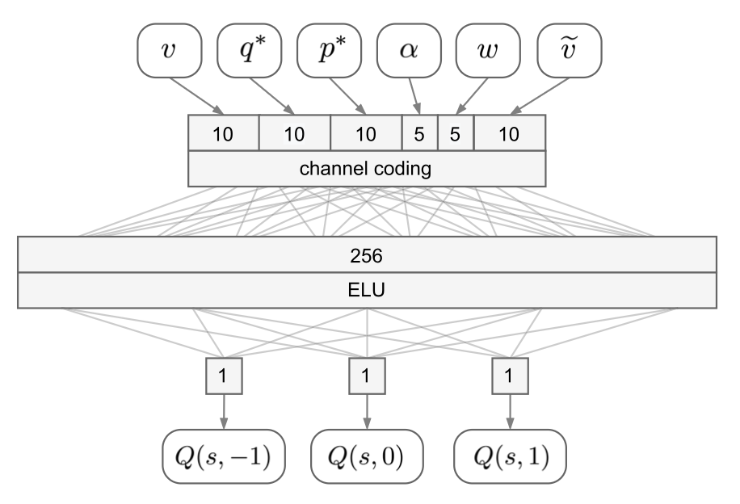

## Abstract

Driving requires handling unpredictable situations. When a pedestrian might suddenly cross the road, a prudent driver limits speed even before danger is certain. This work uses **reinforcement learning** to learn a **safe speed function**—a high-level behavioural directive that caps the **requested cruising speed (RCS)** of an existing autonomous driving system (ADS), rather than learning low-level control from scratch. A **safe speed neural network (SSNN)** maps the pedestrian context (gaps, orientation, speeds) onto discrete actions that decrease, keep, or increase the RCS so that emergency braking remains feasible if the pedestrian crosses unpredictably. Training uses **deep Q-learning** in the OpenDS simulator with distracted, crossing-prone pedestrians; the policy transfers to a real vehicle. Statistical analysis shows improved safety at comparable travel speeds. Code is available under MIT license ([GitHub](https://github.com/tonegas/safe-speed-neural-network), [Zenodo](https://zenodo.org/communities/dreams4cars)).

## Cautious driving with a structured SSNN {toc-text="Cautious RL"}

The paper adopts a **layered control** architecture inspired by basal-ganglia inhibition of risky affordances: a full **driver agent** (ADS) still plans motion primitives, while a separate **SSNN** module assesses risk and adjusts only the RCS—the highest speed the agent is allowed to target. This extends cognition without relearning the entire sensorimotor stack.

The RL problem is **model-free double DQL**: state $\mathbf{s}_t = \langle v_t, q^*_t, p^*_t, \alpha_t, w_t, \Delta v_t \rangle$ collects vehicle speed, **longitudinal and lateral gaps** $q^*, p^*$ to the pedestrian (normalised by vehicle and pedestrian size plus a safety margin $\delta$), pedestrian orientation $\alpha$ and speed $w$, and current RCS $\Delta v$. Actions $A = \{-1, 0, 1\}$ step the RCS by $\pm 0.25\,\mathrm{m/s}$. The network outputs $\langle Q(s,-1), Q(s,0), Q(s,1) \rangle$ directly (one Q-value per action) instead of a separate head per $(s,a)$ pair.

### Channel-coded architecture (Figure 5)

**Figure 5** is the core **model-structured** design. The first layer is not a conventional vectorisation of scalars: each continuous input is expanded with **channel coding**—a cumulative activation that turns a scalar into a **population code** where larger inputs progressively switch on more channels (logistic thresholds along the input range). This is an explicit structural choice, not an emergent representation inside a black-box MLP.

| Input | Role | Channels |
|-------|------|----------|
| $v$ | Vehicle speed | 10 |
| $\Delta v$ | Current RCS | 10 |
| $q^*$ | Longitudinal gap to pedestrian | 10 |
| $p^*$ | Lateral gap to pedestrian | 10 |
| $\alpha$ | Pedestrian orientation w.r.t. road | 5 |
| $w$ | Pedestrian speed | 5 |

Together the channel layer has **50 input neurons**. Channel coding supports **piecewise** policies, partitions the state space without collapse under imbalanced data, and yields **disentangled** channels that can be interpreted—e.g. thresholds on $p^*$ are placed uniformly on $[0, 10]\,\mathrm{m}$ so the network is sensitive near the lane and **saturates** beyond $\sim 10$–$12 m$ (“far pedestrian”), avoiding over-trust in noisy lateral estimates; $q^*$ uses similarly spaced channels to smooth behaviour along the road. After encoding, a single **fully connected** hidden layer (256 units, **ELU**) feeds a linear **3-neuron** output for the Q-vector. Target and online networks share this layout in double DQL.

::: {.paper-network-figures}
{fig-alt="Figure 5: SSNN architecture with channel-coded input layer, 256-neuron ELU hidden layer, and three Q-value outputs" width=95%}
:::

Training in OpenDS stresses rare but dangerous crossings; at inference the SSNN modulates RCS while the ADS still handles braking when the pedestrian is already on the road. The explicit **channel-coding front-end**—fixed topology, hand-placed receptive fields, interpretable saturation—is an early instance of embedding domain structure before learning, in line with later **MSNN** and **nnodely** work in Neu4mes.
