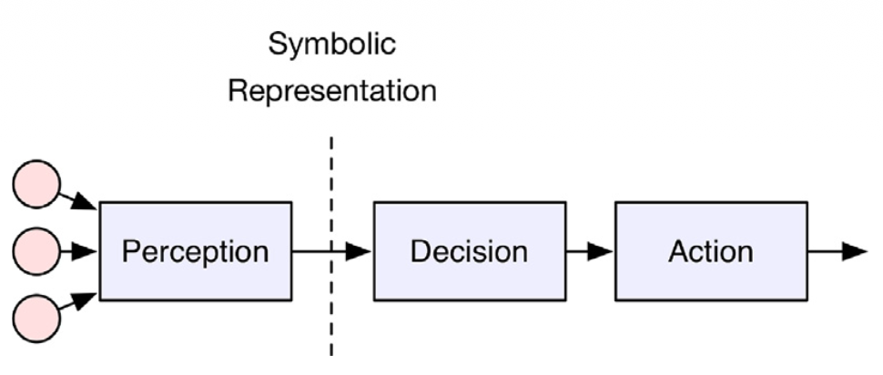
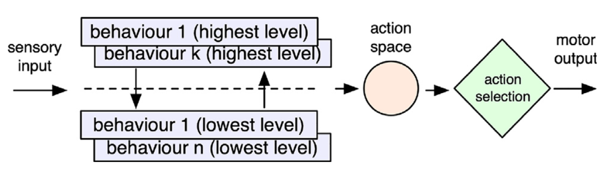
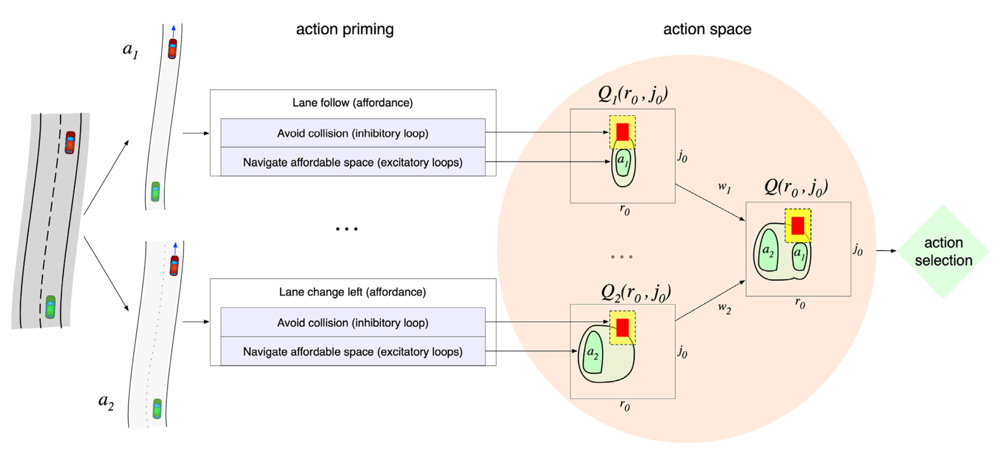

## Abstract

Autonomous driving is slowed by **corner cases**: rare, nuanced situations that narrow-AI stacks fail to handle. The paper argues that many such failures come from architectures that lack the broad, embodied knowledge humans use in emergencies. As an alternative inspired by biological organization, it uses **affordance competition** inside a **layered control** architecture: many action opportunities are primed in parallel, then a central competition selects the best instantaneous control—producing polite, adaptive merge, overtake, and interaction behaviours **without** scenario-specific rule programming. Six simulated examples (including motorway merge) are shown in Dreams4Cars; merge behaviour is contrasted with a conventional algorithmic ramp-entry solution from the literature. The architectural ideas can strengthen robustness of self-driving stacks even when the full sensorimotor agent is not deployed as-is.

## Autonomous systems and layered MSNN planning {toc-text="Layered MSNN"}

Within the **Neu4mes** project, **wheel vehicles** are a primary demonstrator for **model-structured neural networks (MSNN)**: networks whose topology reflects mechanics and control theory rather than opaque MLPs, trained with limited data and deployed via **nnodely**. A full autonomous stack still needs a **planner** that turns perception into safe motion—but the planner need not be a monolithic “think” block plus hand-written merge/overtake scripts.

This paper sketches a **layered** alternative aligned with Neu4mes goals: **separate layers** for longitudinal intent (free flow, car-following, speed limit, curve), **lateral affordances** (stay lane / change left / change right), and **low-level control** in a shared motor space $(r_0, j_0)$ (curvature rate and longitudinal jerk). High-level directives—speed limits, caution toward pedestrians ([SSNN](../2021-gastone-pietro-rosati-papini-a-reinforcement-learning-a/index.qmd)), traffic rules—can **bias** affordance weights $w_i$ instead of rewriting ad hoc planners for each corner case. **Inverse models** in the stack (learned as in [mental simulation](../2020-mauro-da-lio-a-mental-simulation-approach-for-learning-/index.qmd)) are natural candidates for **MSNN** blocks: structured forward/inverse dynamics at each layer, while **affordance competition** plays the role of a flexible, interpretable **action selector** over parallel hypotheses. In that vision, a “planner” is not one optimizer returning a single trajectory, but the **aggregation and selection** over topographic value maps $Q_i(r_0,j_0)$—computable with structured nets and competition, as in the Dreams4Cars implementation below.

## Two approaches to the driving stack

The paper contrasts the dominant **narrow-AI** decomposition with a **cognitively inspired** layered stack. Figures 1 and 3 capture that opposition.

### Sense–think–act (Figure 1)

**Figure 1** is the **sense–think–act** pipeline used in most industrial AD software: perception builds a world model, a central module reasons on symbolic states, actuation executes the chosen manoeuvre. Engineers fix **object classes** (car, pedestrian, …) and **program behaviours** per class. That decomposition works when states are fully specifiable in advance; it becomes brittle when symbols carry no physics, when representations are wrong (e.g. a parked car with an open door treated like traffic), or when behaviour logic must enumerate many subcases (merge, cut-in, courtesy yield). Corner cases often trace to this **Cartesian** split rather than to sensing alone.

::: {.paper-network-figures}
{fig-alt="Figure 1: classical sense-think-act autonomous driving architecture" width=95%}
:::

### Layered control and affordance competition (Figure 3)

**Figure 3** replaces the single “think” stage with a **layered control** architecture. A **subsumption stack** (left, violet) continuously **primes** many affordances detected in the scene—parallel “what I could do now” options (orange pool). **Affordance competition** (Cisek) then **selects** one action from that pool via a robust centralized process, so the system always knows which alternatives were active and why one won. Behaviour is **emergent** from competition over primed controls, not from a growing catalogue of scenario-specific algorithms. This is the architectural template Neu4mes-style autonomy can adopt at the **planning/behaviour** level: parallel structured hypotheses plus selection, instead of one brittle sequential planner.

::: {.paper-network-figures}
{fig-alt="Figure 3: layered control with subsumption stack priming affordances and affordance competition for selection" width=95%}
:::

For **merge on a ramp**, a traditional stack may rely on a dedicated **GIDM-style** speed law (Kreutz & Eggert, 2021) with tuned 1D schematizations; the layered agent in Section 4.2 obtains comparable time-to-collision adaptation **without** that separate merge algorithm—emergent from affordance navigation.

## Dreams4Cars: affordance maps and selection (Figure 4)

**Figure 4** shows the **Dreams4Cars** realisation of Figure 3 (Da Lio et al., 2020). Each affordance $a_i$—e.g. stay in lane ($a_1$) or move left ($a_2$)—has its own **topographic value map** $Q_i(r_0, j_0)$ over instantaneous lateral and longitudinal controls. **Excitatory** loops raise value in free navigable regions (green contours, brighter = higher salience); **inhibitory** loops suppress areas near obstacles (yellow) or collisions (red). Maps are merged into a single decision surface

$$Q(r_0, j_0) = \max_i \bigl( w_i \, Q_i(r_0, j_0) \bigr),$$

where weights $w_i$ implement **high-level steering** of behaviour (legal rules, long-term caution, human–vehicle interaction) without replacing the competition mechanism. Final choice uses **MSPRT** (multihypothesis sequential probability ratio test) to pick the highest-salience control under noise and a time bound—favouring **minimum commitment**: selecting one $(r_0,j_0)$ commits to a **family** of nearby future manoeuvres, preserving adaptability when the scene changes (e.g. merge, overtake, obstacle pass in Section 4).

::: {.paper-network-figures}
{fig-alt="Figure 4: Dreams4Cars layered control—per-affordance Q maps in motor space, obstacle inhibition, weighted aggregation" width=95%}
:::

Read together, **Figure 1** is the conventional stack Neu4mes aims to enrich layer by layer; **Figure 3** is the target organisation; **Figure 4** is how **planning-relevant structure** (parallel $Q_i$, weights, competition) can be implemented on a vehicle platform—with **MSNN** modules supplying the learned inverse dynamics and structured high-level maps in future Neu4mes/nnodely deployments.
